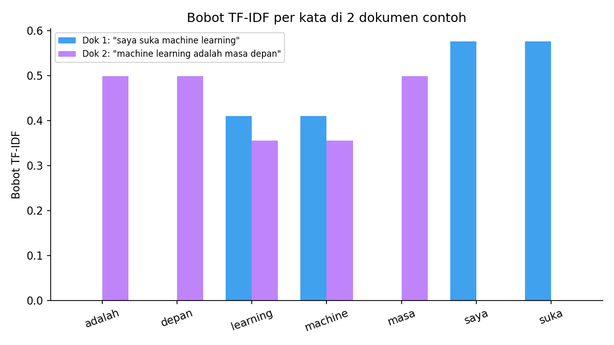

# Text Vectorizer: Bag of Words, N-gram, TF-IDF, dan Word Embedding

Implementasi dan verifikasi empat teknik dasar untuk mengubah teks menjadi representasi numerik (vektor) yang bisa diproses model machine learning — termasuk dua bug nyata yang ditemukan dan diperbaiki.

## Teknik yang Dicakup

| Teknik | Library | Ide Utama |
|---|---|---|
| Bag of Words (BoW) | `sklearn.CountVectorizer` | Hitung frekuensi kemunculan kata, abaikan urutan |
| N-gram | `sklearn.CountVectorizer(ngram_range=...)` | Jaga kombinasi kata berurutan tetap utuh |
| TF-IDF | `sklearn.TfidfVectorizer` | Bobot kata disesuaikan seberapa umum kata itu di seluruh korpus |
| Word Embedding | `spaCy` (+ bonus `gensim.Word2Vec`) | Petakan kata ke vektor berdimensi rendah |

## Hasil Terverifikasi

Dokumen contoh: `"saya suka machine learning"` dan `"machine learning adalah masa depan"`.

Kata yang muncul di **kedua** dokumen (`machine`, `learning`) mendapat bobot TF-IDF lebih rendah (~0.36–0.41) dibanding kata yang cuma muncul di satu dokumen (~0.50–0.58) — inilah yang membedakan TF-IDF dari BoW biasa:



*Grafik di atas dihasilkan langsung dari eksekusi notebook, bukan ilustrasi manual.*

## Audit & Bug yang Ditemukan

Notebook ini awalnya dibangun dari contoh kode Word2Vec/gensim di slide materi. Setelah notebook praktik asli dari kelas ditemukan, ternyata teknik yang benar-benar dipakai untuk Word Embedding adalah **spaCy** — dan proses verifikasi ulang menemukan dua bug nyata:

1. **`en_core_web_sm` tidak punya word vector sama sekali.** `len(nlp.vocab.vectors)` menghasilkan **0**. Model kecil spaCy secara desain tidak menyertakan pretrained word vector — angka `.vector` yang tampil cuma tensor internal tagger/parser/NER, bukan representasi makna. spaCy sendiri memunculkan warning eksplisit soal ini saat `.similarity()` dipanggil.
2. **Lemmatizer Bahasa Indonesia (`spacy.lang.id.Indonesian()`) selalu mengembalikan string kosong.** `nlp.pipe_names` menghasilkan `[]` — pipeline itu cuma tokenizer tanpa komponen lemmatizer apa pun. Diperbaiki dengan mengganti ke **Sastrawi**, library stemming Bahasa Indonesia yang juga dipakai di proyek FAQ search engine.
3. **Word2Vec dengan korpus 2 kalimat pendek** (disertakan sebagai bonus perbandingan) juga tidak menghasilkan embedding yang bermakna — similarity score-nya di bawah 0.1. Penyebabnya beda dari bug #1, tapi pelajarannya sama: jangan asumsikan vector itu bermakna hanya karena angkanya ada.

## Cara Menjalankan

```bash
pip install -r requirements.txt
python -m spacy download en_core_web_sm
jupyter notebook text_vectorizer_bow_tfidf_word2vec.ipynb
```

## Struktur Repo

```
.
├── README.md
├── requirements.txt
├── .gitignore
├── text_vectorizer_bow_tfidf_word2vec.ipynb
└── images/
    └── tfidf-weight-comparison.png
```

## Proyek Terkait

Penerapan TF-IDF untuk sistem pencarian FAQ (termasuk audit Euclidean vs Cosine similarity) dibahas di repo terpisah: [`faq-search-engine-tfidf-sastrawi-arielshakaramiro`](https://github.com/arielshakaramiro/faq-search-engine-tfidf-sastrawi-arielshakaramiro).

---

*Bagian dari catatan belajar AI Engineering saya.*
